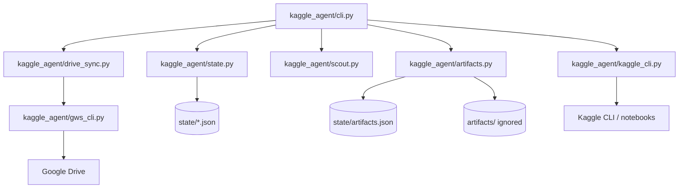
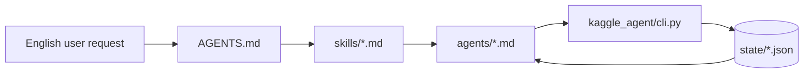
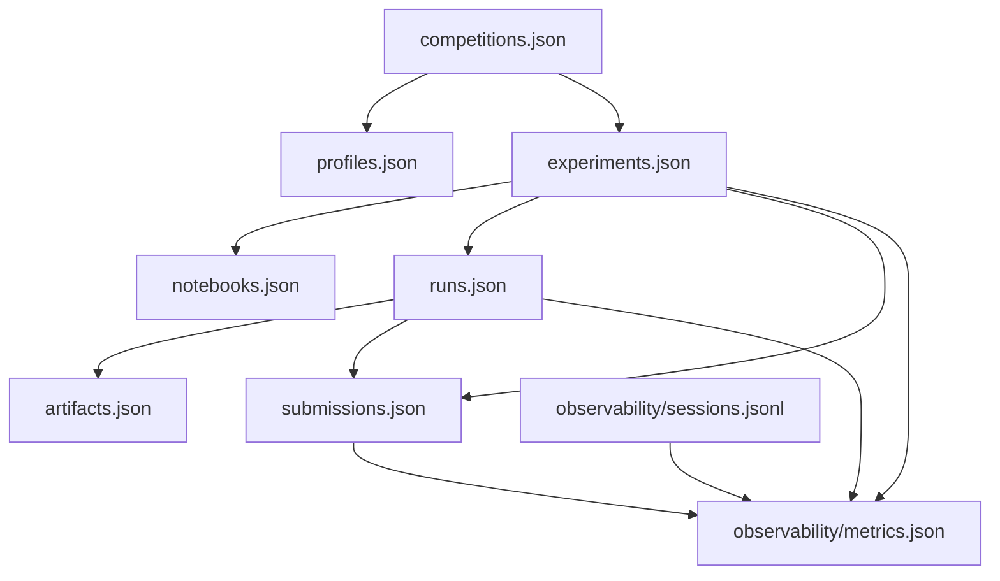

# Codebase Map

Use this map to decide where a coding agent should make changes.

## Runtime Graph

## Agent Graph

## State Graph

## Change Targets

- New CLI command: edit `kaggle_agent/cli.py`, add tests in `tests/test_cli.py`.
- New state file/default: edit `kaggle_agent/state.py`, update `docs/state-schemas.md`.
- Kaggle CLI behavior: edit `kaggle_agent/kaggle_cli.py`; keep wrappers thin.
- Google Drive behavior: edit `kaggle_agent/drive_sync.py` or `kaggle_agent/gws_cli.py`.
- Output/log/submission artifact behavior: edit `kaggle_agent/artifacts.py`.
- Competition scouting shape: edit `kaggle_agent/scout.py`.
- User-facing workflow prompt: edit `skills/<workflow>/SKILL.md`.
- Role/persona behavior: edit `agents/<role>.md`.
- Notebook/report skeleton: edit `templates/`.

## Design Constraint

Keep production code small. Prefer simple state records and explicit tests over framework code. Do not add a new abstraction unless it removes repeated behavior across at least two real commands.
