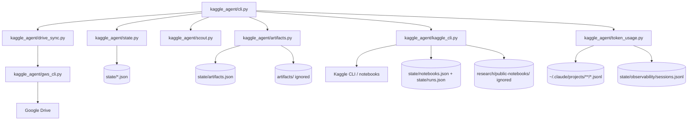
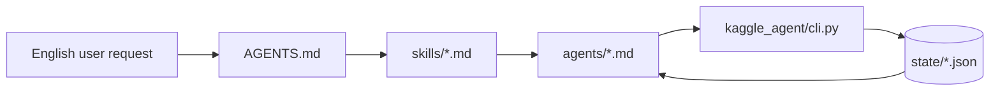
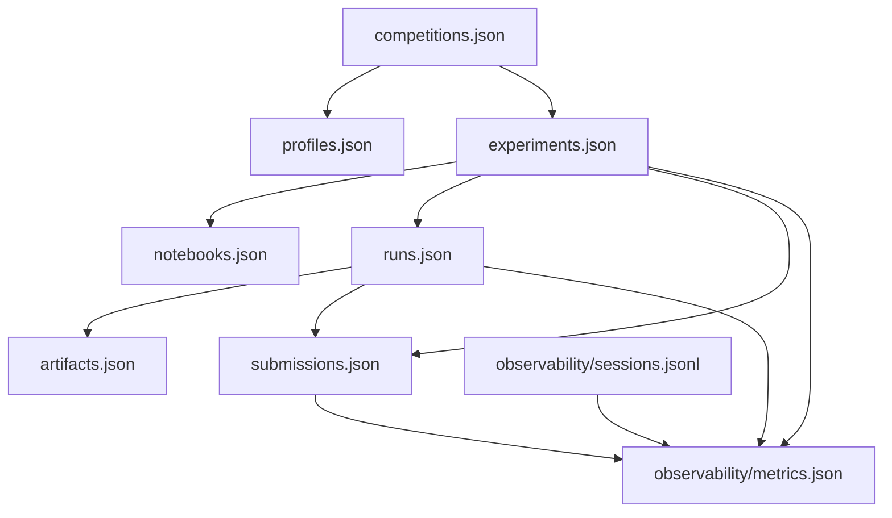

# Codebase Map

Use this map to decide where a coding agent should make changes.

## Runtime Graph

## Agent Graph

## State Graph

## Change Targets

- New CLI command: edit `kaggle_agent/cli.py`, add tests in `tests/test_cli.py`.
- New state file/default: edit `kaggle_agent/state.py`, update `docs/state-schemas.md`.
- Kaggle CLI behavior, including public notebook discovery/pull: edit `kaggle_agent/kaggle_cli.py`; keep wrappers thin. Every unit/CLI test stubs `uvx kaggle` with hand-written JSON, so they can only prove "our code handles the shape we assumed," never that the shape is real. Before and after changing anything that parses Kaggle CLI stdout, run `KAGGLE_AGENT_LIVE_TESTS=1 uv run pytest tests/test_live_kaggle_api.py -v` (read-only, needs `~/.kaggle/credentials.json`) to check against the real API. This is how the pagination-banner bug in `parse_json_output` was found.
- Google Drive behavior: edit `kaggle_agent/drive_sync.py` or `kaggle_agent/gws_cli.py`. Same real-API caveat as Kaggle: run `KAGGLE_AGENT_LIVE_TESTS=1 uv run pytest tests/test_live_gws_api.py -v` before/after changes. `drive_upload`/`drive_update` accept `dry_run=True` specifically so request shape can be checked against the real API without ever creating or modifying a file.
- Output/log/submission artifact behavior: edit `kaggle_agent/artifacts.py`.
- Competition scouting shape: edit `kaggle_agent/scout.py`.
- Session token-usage parsing: edit `kaggle_agent/token_usage.py`.
- Cross-session/cross-harness prompt history: edit `kaggle_agent/prompt_history.py`; hook registration lives in `.claude/settings.json` (Claude Code) and `AGENTS.md`'s End Of Session step (Codex).
- User-facing workflow prompt: edit `skills/<workflow>/SKILL.md`.
- Role/persona behavior: edit `agents/<role>.md`.
- Notebook/report skeleton: edit `templates/`.

## Design Constraint

Keep production code small. Prefer simple state records and explicit tests over framework code. Do not add a new abstraction unless it removes repeated behavior across at least two real commands.
